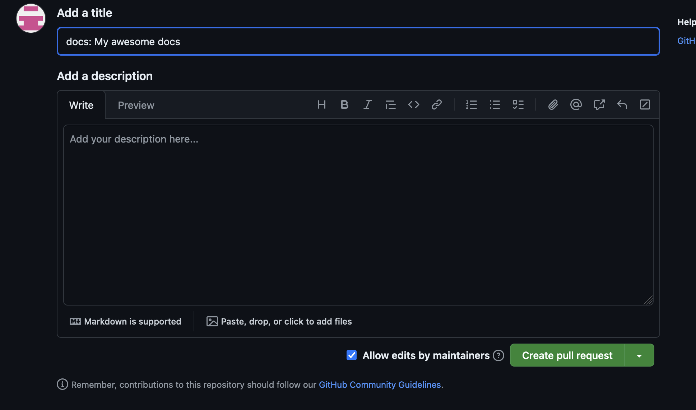

# Contributing to Documentation

The documentation for Pywr V2 is located in the pywr-next repository, [here](https://github.com/pywr/pywr-next) in the `pywr-book` subfolder.

The documentation is written using 'markdown', a format which enables easy formatting for the web. 

This website can help get started: [www.markdownguide.org](https://www.markdownguide.org)

To contribute documentation for Pywr V2, we recommend following the steps below to ensure we can review and integrate any changes as easily as possible.

## Steps to create documentation

1. Fork the pywr-next repository


2. Clone the fork

``` <bash>
    git clone https://github.com/MYUSER/pywr-next
```

3. Create a branch

``` <bash>
    git checkout -b my-awesome-docs
```

4. Open the book documentation in your favourite editor

``` <bash>
    vi pywr-next/pywr-book/introduction.md
```

Which should look something like this:


5. Having modified the documentation, add and commit the changes <ins>using the commit format<ins>

```<bash>
git add introduction.md"
```

```<bash>
git commit -m "docs: Add an example documentation"
```

6. Create a pull request from your branch 
  1. In your fork, click on the 'Pull Requests' tab
    

  2. Click on 'New Pull Request'
    

  3. Choose your branch from the drop-down on the right-hand-side
    

  4. Click 'Create Pull Request' when the button appears 
    

  5. Add a note if you want, and click 'Create Pull Request'
    

